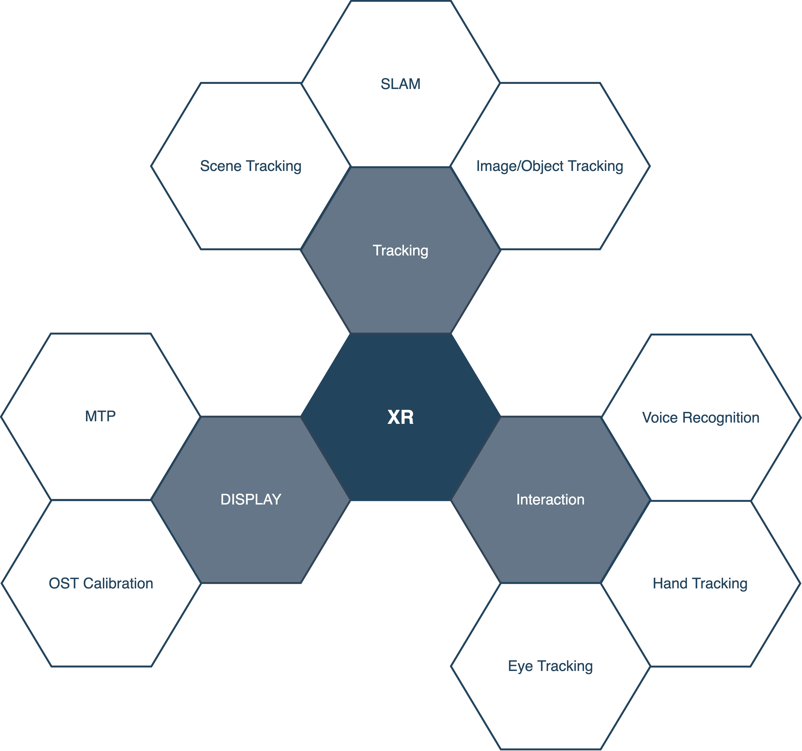

# Recent_XR_Research_2022

【学习、分享和交流】跟踪XR前沿动态 （2022），包括：VIO、视觉SLAM、惯性导航、传感器标定、深度学习SLAM、多传感器融合、视觉惯导软硬件协同设计、视觉惯导系统仿真和测评、复杂环境视觉感知、视觉导航、AR/VR等类别。  
该仓库fork自[YiChenCityU/Recent_SLAM_Research](https://github.com/YiChenCityU/Recent_SLAM_Research)，原作者的知识成果版权，仍归原作者所有。

[SLAM research 2018](https://github.com/highlightz/Recent_SLAM_Research/blob/master/SLAM_Research_2018.md)

[SLAM research 2019](https://github.com/highlightz/Recent_SLAM_Research/blob/master/SLAM_Research_2019.md)

[SLAM research 2020](https://github.com/highlightz/Recent_SLAM_Research/blob/master/SLAM_Research_2020.md)

[SLAM research 2021](https://github.com/highlightz/Recent_SLAM_Research/blob/master/SLAM_Research_2021.md)

---
### SLAM 
#### 1. [VIO] [2022-01-11_DM-VIO: Delayed Marginalization Visual-Inertial Odometry](https://arxiv.org/abs/2201.04114) | [code](https://vision.in.tum.de/research/vslam/dm-vio?redirect=1)

#### 2. [VIO, DNN, VINS-Mono based] [2022-01-14_SRVIO: Super Robust Visual Inertial Odometry for dynamic environments and challenging Loop-closure conditions](https://arxiv.org/abs/2201.05386)

#### 3. [Calibration] [2022_01-29_Online Self-Calibration for Visual-Inertial Navigation Systems: Models, Analysis and Degeneracy](https://arxiv.org/abs/2201.09170)
几个结论：  
- RS相机在线的readout-time标定比较重要，对VIO状态估计最终的精度影响较大；
- IMU的gravity sensitivity（Tg）和Rwa对VIO系统性能影响较小；
- 不同IMU对gyro和acc重要程度不同，比如文中Bosch的BMI160的gyro noise很大，所以对gyro的bias和scale标定对状态估计精度有质的提升；然而其他IMU（MicroStrain GX5-25, MicroStrain GX5-35, Xsens MTi 100）相反地acc的noise很大。

#### 4. [SLAM] [2022-02-14_DE-SLAM: SLAM for highly dynamic environment](https://onlinelibrary.wiley.com/doi/abs/10.1002/rob.22062)

#### 5. [VISLAM] [2022-02-18_OKVIS2: Realtime Scalable Visual-Inertial SLAM with Loop Closure](https://arxiv.org/abs/2202.09199)
#### 6. [benchmark] [2022-02-23_Are We Ready for Robust and Resilient SLAM? A Framework For Quantitative Characterization of SLAM Datasets](https://arxiv.org/abs/2202.11312)

#### 7. [VIO] [2022-03-14_A Self-Supervised, Differentiable Kalman Filter for Uncertainty-Aware Visual-Inertial Odometry](https://arxiv.org/abs/2203.07207)

#### 8. [SLAM, Andrew J. Davison] [2022-03-15_Simultaneous Localisation and Mapping with Quadric Surfaces](https://arxiv.org/abs/2203.08040)

#### 9. [SLAM, RGB-D&LiDAR] [2022-03-24_MD-SLAM: Multi-cue Direct SLAM](https://arxiv.org/abs/2203.13237) | [code](https://github.com/digiamm/md_slam)

#### 10. [RGB-D, SLAM] [2022-03-25_FD-SLAM: 3-D Reconstruction Using Features and Dense Matching](https://arxiv.org/abs/2203.13861)

#### 11. [Point Cloud, ICP, LiDAR SLAM] [2022-03-25_Gravity-constrained point cloud registration](https://arxiv.org/abs/2203.13799) | [code](https://github.com/ethz-asl/libpointmatcher)

#### 12. [VI-Localization] [2022-04_26_Map-based Visual-Inertial Localization: Consistency and Complexity](https://arxiv.org/abs/2204.12173)

#### 13. [Collaborative VI-SLAM] [2022-11-04_D2SLAM: Decentralized and Distributed Collaborative Visual-inertial SLAM System for Aerial Swarm](https://arxiv.org/pdf/2211.01538.pdf)

---

### AR

#### 1. [Interaction] [2022-01-25_AnyGesture: Arbitrary One-Handed Gestures for Augmented, Virtual, and Mixed Reality Applications](https://scholar.google.com/scholar_url?url=https://www.mdpi.com/2076-3417/12/4/1888/pdf&hl=zh-CN&sa=X&d=569801102176849297&ei=e7spYsKnGJGJmwGt9K-wAQ&scisig=AAGBfm0iKA1H3hgwN4p67iekcUr7f-XAZA&oi=scholaralrt&html=&pos=0&folt=rel)

#### 2. [User Experience] [2022-02-09_Cybersickness and Its Severity Arising from Virtual Reality Content: A Comprehensive Study](https://scholar.google.com/scholar_url?url=https://www.mdpi.com/1424-8220/22/4/1314/pdf&hl=zh-CN&sa=X&d=194531123073878741&ei=e7spYsKnGJGJmwGt9K-wAQ&scisig=AAGBfm04aJGj1NbYYGgaMYH1zvFJA0OT6A&oi=scholaralrt&html=&pos=1&folt=rel)

#### 3. [survey] [2022-02-18_Modern Augmented Reality: Applications, Trends, and Future Directions](https://arxiv.org/abs/2202.09450)

#### 4. [AR & Robotics] [2022-02-23_Virtual, Augmented, and Mixed Reality for Human-Robot Interaction: A Survey and Virtual Design Element Taxonomy](https://arxiv.org/abs/2202.11249)
#### 5. [AR & 5G] [2022-03-04_Extended Reality (XR) over 5G and 5G-Advanced New Radio: Standardization, Applications, and Trends](https://arxiv.org/abs/2203.02242)
#### 6. [AR & Robotics] [2022-03-07_Augmented Reality and Robotics: A Survey and Taxonomy for AR-enhanced Human-Robot Interaction and Robotic Interfaces](https://arxiv.org/abs/2203.03254)

#### 7. [UI, Meta] [2022_Exploring Spatial UI Transition Mechanisms with Head-Worn Augmented Reality](https://scholar.google.com/scholar_url?url=https://ericlu.me/papers/ui_transition_chi22_preprint.pdf&hl=zh-CN&sa=X&d=6257014197178048915&ei=l7UrYuuMFJGJmwHIxpjYAw&scisig=AAGBfm2wUiNfyy7u62H3vDudhJyvaIpzcw&oi=scholaralrt&html=&pos=1&folt=rel)

#### 8. [AR & Communication] [2022-03-08_ARcall: Real-Time AR Communication using Smartphones and Smartglasses](https://arxiv.org/abs/2203.04358)

#### 9. [AR & Robotics] [2022-03-16_Design and Evaluation of an Augmented Reality Head-Mounted Display Interface for Human Robot Teams Collaborating in Physically Shared Manufacturing Tasks](https://arxiv.org/abs/2203.08343)

#### 10. [AR & Ethics] [2022_Pervasive Augmented Reality—Technology and Ethics](https://scholar.google.com/scholar_url?url=https://ieeexplore.ieee.org/iel7/7756/5210084/09733791.pdf&hl=zh-CN&sa=X&d=8420753794810736769&ei=lnM1YpL0JIytmwGEj6qIDw&scisig=AAGBfm3y8w4_1qEI_5lUPwNZ0C5ucavbFg&oi=scholaralrt&html=&pos=0&folt=rel)

---

### Localization
#### 1. [VPR] [2022-02-18_MultiRes-NetVLAD: Augmenting Place Recognition Training with Low-Resolution Imagery](https://arxiv.org/abs/2202.09146) |  [code](https://github.com/Ahmedest61/MultiRes-NetVLAD)

---

### XR算法堆栈

